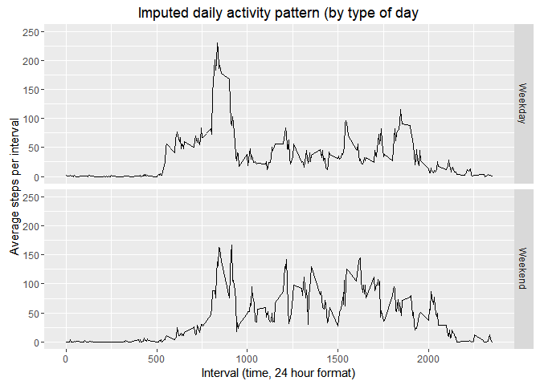

### **Background**

This assignment makes use of data from a personal activity monitoring device. This device collects data at 5 minute intervals throughout the day. The data consists of two months of data from an anonymous individual collected during the months of October and November, 2012 and includes the number of steps taken in 5 minute intervals each day.

The data is available to be downloaded from the course website at https://d396qusza40orc.cloudfront.net/repdata%2Fdata%2Factivity.zip as *repdata_data_activity.zip*. A prior check of this file confirms that the zipped contents comprise a single *activity.csv* file.

### **Loading and pre-processing the data**

The first step is to download the .zip file from the internet, unzip the zip file, and read the zipped *activity.csv* into R.


```r
        download.file("https://d396qusza40orc.cloudfront.net/repdata%2Fdata%2Factivity.zip",
                      "repdata_data_activity.zip")
        unzip("repdata_data_activity.zip")
        activity <- read.csv("activity.csv", stringsAsFactors = FALSE)
```

#### Initial look at the data

The results displayed below show the data table's dimensions (rows x columns), describe the table's variables, and summarise the tables variables.


```r
        dim(activity)
```

```
## [1] 17568     3
```

```r
        str(activity)
```

```
## 'data.frame':	17568 obs. of  3 variables:
##  $ steps   : int  NA NA NA NA NA NA NA NA NA NA ...
##  $ date    : chr  "2012-10-01" "2012-10-01" "2012-10-01" "2012-10-01" ...
##  $ interval: int  0 5 10 15 20 25 30 35 40 45 ...
```

```r
        summary(activity)
```

```
##      steps            date              interval     
##  Min.   :  0.00   Length:17568       Min.   :   0.0  
##  1st Qu.:  0.00   Class :character   1st Qu.: 588.8  
##  Median :  0.00   Mode  :character   Median :1177.5  
##  Mean   : 37.38                      Mean   :1177.5  
##  3rd Qu.: 12.00                      3rd Qu.:1766.2  
##  Max.   :806.00                      Max.   :2355.0  
##  NA's   :2304
```

#### Convert the **date** field from a character string to a date string

The **str(activity)** results show that the date field is formatted as a character string. In order that this field may be used for calculations, the format needs to be changed to a POSIXct date field. A 'day' field shall also be added as it shall be required later on.

The **str(activity)** and **summary(activity)** commands shall then be repeated to verify this has been done.


```r
        library(lubridate)
        activity$date <- ymd(activity$date)
        activity$day <- weekdays(activity$date)
        str(activity)
```

```
## 'data.frame':	17568 obs. of  4 variables:
##  $ steps   : int  NA NA NA NA NA NA NA NA NA NA ...
##  $ date    : Date, format: "2012-10-01" "2012-10-01" ...
##  $ interval: int  0 5 10 15 20 25 30 35 40 45 ...
##  $ day     : chr  "Monday" "Monday" "Monday" "Monday" ...
```

```r
        summary(activity)
```

```
##      steps             date               interval          day           
##  Min.   :  0.00   Min.   :2012-10-01   Min.   :   0.0   Length:17568      
##  1st Qu.:  0.00   1st Qu.:2012-10-16   1st Qu.: 588.8   Class :character  
##  Median :  0.00   Median :2012-10-31   Median :1177.5   Mode  :character  
##  Mean   : 37.38   Mean   :2012-10-31   Mean   :1177.5                     
##  3rd Qu.: 12.00   3rd Qu.:2012-11-15   3rd Qu.:1766.2                     
##  Max.   :806.00   Max.   :2012-11-30   Max.   :2355.0                     
##  NA's   :2304
```

### **What is mean total number of steps taken per day?**

For this part of the assignment, missing values in the dataset are going to be ignored. The following blocks of R code shall:

1. Calculate the total number of steps taken per day
2. Make a histogram of the total number of steps taken each day
3. Calculate and report the mean and median of the total number of steps taken per day

#### 1. Calculate the total number of steps taken per day


```r
        library(dplyr)        
        totalsteps <- activity %>% group_by(date) %>% summarise(stepsperday = sum(steps, na.rm = TRUE))
        totalsteps$stepsperday
```

```
##  [1]     0   126 11352 12116 13294 15420 11015     0 12811  9900 10304
## [12] 17382 12426 15098 10139 15084 13452 10056 11829 10395  8821 13460
## [23]  8918  8355  2492  6778 10119 11458  5018  9819 15414     0 10600
## [34] 10571     0 10439  8334 12883  3219     0     0 12608 10765  7336
## [45]     0    41  5441 14339 15110  8841  4472 12787 20427 21194 14478
## [56] 11834 11162 13646 10183  7047     0
```

#### 2. Make a histogram of the total number of steps taken each day


```r
        hist(totalsteps$stepsperday,
             breaks = 5,
             xlab = "Steps per day",
             main = "Daily activity data",
             ylim = c(0, 30),
             col = "wheat")
```

<!-- -->

#### 3. Calculate and report the mean and median of the total number of steps taken per day


```r
        options("scipen" = 100, "digits" = 2)
        oldmean <- mean(totalsteps$stepsperday)
        oldmedian <- median(totalsteps$stepsperday)
```

The mean and median number of steps taken each day are **9354.23** and **10395** respectively.

### **What is the average daily activity pattern?**

**ASSUMPTION: Intervals with NA are excluded from this analysis.**

#### 1. Time series plot

This next block of R code shall make a time series plot of the number of steps taken each day at five minute intervals starting at midnight, averaged across all days.


```r
        library(dplyr)
        dailypattern <- activity %>%
                group_by(interval) %>%
                summarise(stepsperinterval = mean(steps, na.rm = TRUE))
        
        # create time series plot
        
        plot(x = dailypattern$interval,
             y = dailypattern$stepsperinterval,
             type = "l",
             xlab = "Interval (time, 24 hour format)",
             ylab = "Average steps per interval (all days)",
             main = "Daily activity pattern")
```

<!-- -->

#### 2. Maximum steps per interval

This next block of R code shall calculate the time of day (in 24 hour format) for the five minute interval that had the highest number of steps averaged across all days, and the average number of steps for that interval.


```r
        options("scipen" = 100, "digits" = 0)
        maxstepsinterval <- filter(dailypattern, stepsperinterval == max(stepsperinterval))
        maxstepsinterval$interval
```

```
## [1] 835
```

```r
        maxstepsinterval$stepsperinterval
```

```
## [1] 206
```

The maximum number of steps taken in any five minute interval during the day, averaged across all days, was **206** steps taken at **0835** (24 hour time format). 

### **Imputing missing values**

#### 1. Calculate and report the total number of missing values in the dataset (i.e. the total number of rows with NAs)


```r
        nrow(activity[is.na(activity$steps),])
```

```
## [1] 2304
```

**2304** rows are missing 'steps per interval' data.

#### 2. Strategy for imputing missing values

The 2,304 rows with missing values shall have their NAs substituted with the average for the relevant 5-minute interval.

#### 3. Create a new dataset that is equal to the original dataset but with the missing data filled in.


```r
        # create new table to hold populated NA values
        popactivity <- activity
        # identify the rows with NA values
        narows <- is.na(popactivity$steps)
        # calculate the average steps per interval across all days
        avinterval <- tapply(popactivity$steps, popactivity$interval, mean, na.rm = TRUE, simplify = TRUE)
        # apply average steps per interval to rows with NA values 
        popactivity$steps[narows] <- avinterval[as.character(popactivity$interval[narows])]
        # create new table with imputed steps per day
        imputedsteps <- popactivity %>% group_by(date) %>% summarise(stepsperday = sum(steps, na.rm = TRUE))
        # confirm NA rows have been populated
        summary(activity)
```

```
##      steps           date               interval        day           
##  Min.   :  0    Min.   :2012-10-01   Min.   :   0   Length:17568      
##  1st Qu.:  0    1st Qu.:2012-10-16   1st Qu.: 589   Class :character  
##  Median :  0    Median :2012-10-31   Median :1178   Mode  :character  
##  Mean   : 37    Mean   :2012-10-31   Mean   :1178                     
##  3rd Qu.: 12    3rd Qu.:2012-11-15   3rd Qu.:1766                     
##  Max.   :806    Max.   :2012-11-30   Max.   :2355                     
##  NA's   :2304
```

```r
        summary(popactivity)
```

```
##      steps          date               interval        day           
##  Min.   :  0   Min.   :2012-10-01   Min.   :   0   Length:17568      
##  1st Qu.:  0   1st Qu.:2012-10-16   1st Qu.: 589   Class :character  
##  Median :  0   Median :2012-10-31   Median :1178   Mode  :character  
##  Mean   : 37   Mean   :2012-10-31   Mean   :1178                     
##  3rd Qu.: 27   3rd Qu.:2012-11-15   3rd Qu.:1766                     
##  Max.   :806   Max.   :2012-11-30   Max.   :2355
```

```r
        # minimum steps, mean, median, and quartiles should all increase
        summary(totalsteps)
```

```
##       date             stepsperday   
##  Min.   :2012-10-01   Min.   :    0  
##  1st Qu.:2012-10-16   1st Qu.: 6778  
##  Median :2012-10-31   Median :10395  
##  Mean   :2012-10-31   Mean   : 9354  
##  3rd Qu.:2012-11-15   3rd Qu.:12811  
##  Max.   :2012-11-30   Max.   :21194
```

```r
        summary(imputedsteps)
```

```
##       date             stepsperday   
##  Min.   :2012-10-01   Min.   :   41  
##  1st Qu.:2012-10-16   1st Qu.: 9819  
##  Median :2012-10-31   Median :10766  
##  Mean   :2012-10-31   Mean   :10766  
##  3rd Qu.:2012-11-15   3rd Qu.:12811  
##  Max.   :2012-11-30   Max.   :21194
```

#### 4. Histogram

Make a histogram of the total number of steps taken each day and Calculate and report the **mean** and **median** total number of steps taken per day. Do these values differ from the estimates from the first part of the assignment? What is the impact of imputing missing data on the estimates of the total daily number of steps?


```r
        hist(imputedsteps$stepsperday,
             breaks = 5,
             xlab = "Imputed steps per day",
             main = "Daily activity data",
             sub = "(NA values re-populated with average interval values)",
             ylim = c(0, 35),
             col = "cyan")
```

<!-- -->


```r
        options("scipen" = 100, "digits" = 0)
        newmean <- mean(imputedsteps$stepsperday)
        newmedian <- median(imputedsteps$stepsperday)
        diffmean <- newmean - oldmean
        diffmedian <- newmedian - oldmedian
```

Before the missing 'steps per interval' data was re-populated with values imputed from the average for each relevant interval, the mean and median number of steps taken per day were **9354** and **10395** respectively.

After the missing 'steps per interval' data was re-populated with values imputed from the average for each relevant interval, the mean and median number of steps taken per day were **10766** and **10766** respectively.

Imputing data increased the mean and median number of steps per day by **1412** and **371** respectively.

### **Are there differences in activity patterns between weekdays and weekends?**

#### 1. New factor variable

Create a new factor variable in the dataset with two levels - "weekday" and "weekend" indicating whether a given date is a weekday or weekend day.


```r
        popactivity <- popactivity %>%
        mutate(typeofday = ifelse(popactivity$day == "Saturday" | popactivity$day == "Sunday",
                "Weekend", "Weekday"))
        head(popactivity)
```

```
##   steps       date interval    day typeofday
## 1     2 2012-10-01        0 Monday   Weekday
## 2     0 2012-10-01        5 Monday   Weekday
## 3     0 2012-10-01       10 Monday   Weekday
## 4     0 2012-10-01       15 Monday   Weekday
## 5     0 2012-10-01       20 Monday   Weekday
## 6     2 2012-10-01       25 Monday   Weekday
```

#### 2. Panel time series plot

Make a panel plot containing a time series plot (i.e. type="l") of the 5-minute interval (x-axis) and the average number of steps taken, averaged across all weekday days or weekend days (y-axis). See the README file in the GitHub repository to see an example of what this plot should look like using simulated data.


```r
        # create table for the two time series plots
        popdailypattern <- popactivity %>% group_by(interval, typeofday) %>% summarise(stepsperinterval = mean(steps, na.rm = TRUE))
        # create panel time series plots using ggplot2
        library(ggplot2)
        qplot(interval,
              stepsperinterval,
              data = popdailypattern,
              geom = "line",
              ylim = c(0, 250),
              xlab = "Interval (time, 24 hour format)",
              ylab = "Average steps per interval",
              main = "Imputed daily activity pattern (by type of day",
              facets = typeofday~.)
```

<!-- -->

